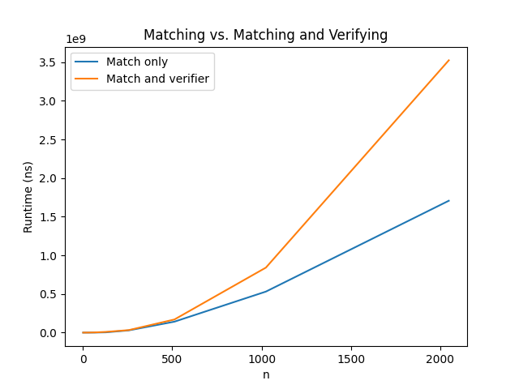

# algorithms-programming-hw-1

NAME: Dylan Esperto

UFID: 53118184

NAME: Tiffany Dang

UFID: 14332676

# Instructions
Use python 3.13 to run the programs in src.
To run the matcher from the repository root, assuming python is in PATH:
- python.exe .\src\matcher.py

To run the verifier, with the same assumptions, use: 
- python.exe .\src\verifier.py

# Task C
As n increases, we noticed that runtimes for match and match and verifier increased as well.
They both do not seem linear.
For match only, from n = 500 to n = 1000, the runtime doubles from .25 to .5 and from n = 1000 to n = 2000,
the runtime roughly jumps 4x, representing quadratic growth. This makes sense and reinforces that match() is O(n^2)
Then for match and verifier, from n = 500 to n = 1000 (n doubles) the runtime roughly triples from .25e9 to .75e9.
Lastly, from n = 1000 to n = 2000, the runtime goes from ~.75e9 to ~3.5e9. The runtime for match and verifier
is consistently slower than just match which makes sense because verifying is also O(n^2). 

